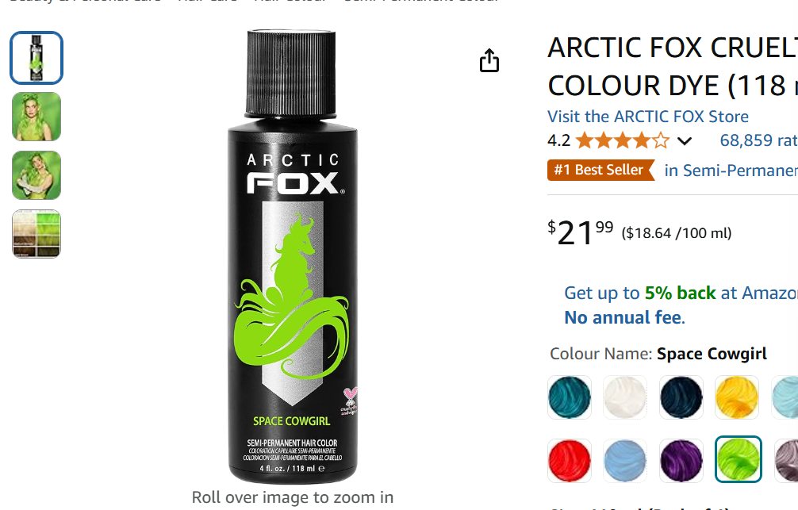

# Workshop 4

By: Heidi Thompson

## Emphasis

United Global Plan of Action for One Health and One Climate, a project led by Trent University with the *International Institute for Environmental Studies* has been awarded a $296,400 Queen Elizabeth II Diamond Jubilee Scholarship (QES) from The Rideau Hall Foundation and _Universities Canada_, to support student- and faculty-led international research projects that focus on the adaptation, response, and resilience to a changing climate.

## Strong

“This award reflects Trent University’s leadership in fostering international mobility and tackling global challenges like climate change through collaboration,” said Dr. Holger Hintelmann, interim vice president of Research & Innovation at Trent University. “As a founding member of the **International Institute for Environmental Studies** (IIES), Trent is committed to preparing the next generation of scholars by offering students and faculty unique opportunities to conduct research abroad and welcoming international researchers to Trent. These experiences allow them to engage with diverse perspectives, learn from __experts worldwide__, and develop a broader understanding of complex global issues beyond our borders.”

## Lists

### Unordered Lists

- List item 1
- List item 2
- List item 3
    - Sub list item 1
    - Sub list item 2
- List item 4

### Ordered Lists

1. First item
2. Second item
    1. Sub item 1
    2. Sub item 2
3. Third item

## Images



[Atric fox - Space cow](https://www.amazon.ca/ARCTIC-FOX-CRUELTY-PERMANENT-COWGIRL/dp/B09WZB31R6/ref=asc_df_B09WZB31R6/?tag=googleshopc0c-20&linkCode=df0&hvadid=706725225246&hvpos=&hvnetw=g&hvrand=3781915192471248501&hvpone=&hvptwo=&hvqmt=&hvdev=c&hvdvcmdl=&hvlocint=&hvlocphy=9000728&hvtargid=pla-1655897359658&mcid=504459fdcc5c34989582e30596bf51cd&gad_source=1&th=1)

## Including code

### Inline

In HTML the `` tag is used to display pictures

### Code Fences

```html
<nav>
    <ul>
        <li><a href="index.html">Home</a></li>
        <li><a href="grid.html">Grid</a></li>
        <li><a href="https://trentu.ca">Trent</a></li>
        <li><a href="https://loki.trentu.ca">Loki</a></li>
    </ul>
</nav>
```

```css
body {
  font-family: system-ui, -apple-system, BlinkMacSystemFont, "Segoe UI", Roboto,
    Oxygen, Ubuntu, Cantarell, "Open Sans", "Helvetica Neue", sans-serif;
  height: 100vh;
  display: flex;
  flex-direction: column;
}
```